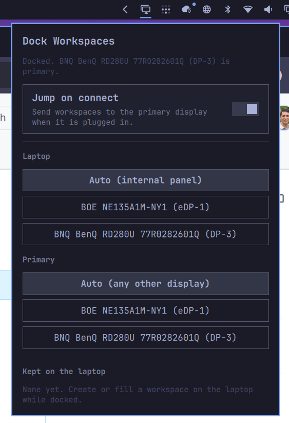

# Dock Workspaces



When you plug in an external display, Hyprland usually leaves your windows on the laptop panel and gives the new screen an empty workspace.

This plugin sends workspaces to the primary display on connect, except ones you created or filled on the laptop during the last dual-monitor session. Unplug still piles everything onto the laptop. Plug back in and that split comes back; anything you started while undocked goes to the primary.

## Install

```sh
omarchy plugin add https://github.com/seanpk/omarchy-dock-workspaces.git --enable
```

That installs the bar widget. It does not edit Hyprland config.

Open the bar icon and click **Add Hyprland loader**. That appends one guarded `dofile` to `~/.config/hypr/hyprland.lua`, after a same-directory atomic write. The line only loads the plugin while this checkout exists, so removing the plugin cannot break Hyprland.

It does not edit `monitors.lua`. Place the external display yourself (above, beside, primary, scale).

## Usage

Click the bar icon to open settings.

- **Add / Remove Hyprland loader** — explicit consent before `hyprland.lua` is touched. Jump on connect does nothing until the loader is present.
- **Jump on connect** — restore workspaces when the primary display appears.
- **Laptop / Primary** — auto-detect (internal `eDP`/`LVDS`/`DSI` vs any other screen), or pin a specific output. Externals are matched by description so DisplayPort numbers can change.
- **Kept on the laptop** — workspace ids remembered from the last docked session.

Move a workspace onto the laptop with Super+Shift+Alt and an arrow. Opening a window there, or creating a workspace there, marks it as laptop-owned.

## Remove

```sh
omarchy plugin remove seanpk.dock-workspaces
```

That deletes the plugin checkout. If you added the loader, click **Remove Hyprland loader** first, or delete the block between `-- seanpk.dock-workspaces start` and `-- seanpk.dock-workspaces end` in `~/.config/hypr/hyprland.lua`. A leftover guarded line is a no-op once the checkout is gone.

Optional leftovers:

```sh
rm -f ~/.config/omarchy/dock-workspaces.json
rm -f ~/.local/state/omarchy/dock-workspaces-laptop-ids
```

## Requirements

- Omarchy with omarchy-shell (Quickshell)
- Hyprland 0.56+ (Lua config API)
- Python 3 (`/usr/bin/python3`) for the file helper

No extra packages, no network, no privileged operations.

## License

MIT
